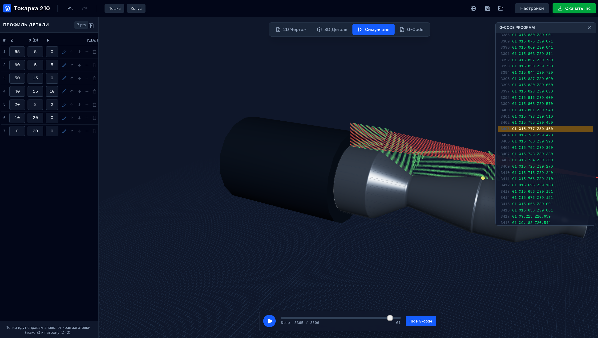

 App Screenshot

---
# LatheCAM 210

G-code generator for CNC lathe machines.

## Purpose

Application for designing turned parts and automatic generation of CNC programs.

## Features

- **Profile editor** — define part contour with Z/X points and fillet radii
- **2D drawing** — profile view with dimensions
- **3D model** — visualisation of finished part
- **Simulation** — machining animation with toolpath display
- **G-code** — generate CNC program with settings for your machine

## Operations

- Facing
- Roughing (with customizable depth of cut)
- Finishing
- Parting

## Usage

1. Define part profile with points (from right edge to chuck)
2. Set stock diameter and tool parameters
3. Select required operations
4. Check result in simulation
5. Export G-code

## Formats

- **Project** — JSON file with all settings
- **G-code** — .nc text file with CNC program

## Languages

- Russian
- English

## Requirements

Any modern browser (Chrome, Firefox, Edge, Safari). Works offline after loading.

# На русском: 

Генератор G-кода для токарных станков с ЧПУ.

## Назначение

Приложение для проектирования токарных деталей и автоматической генерации управляющих программ.

## Возможности

- **Редактор профиля** — задавайте контур точками с координатами Z/X и радиусами скруглений
- **2D чертёж** — просмотр профиля с размерами
- **3D модель** — визуализация готовой детали
- **Симуляция** — анимация процесса обработки с отображением траекторий инструмента
- **G-код** — генерация программы для ЧПУ с настройками под ваш станок

## Операции

- Подрезка торца
- Черновая обработка (с заданной глубиной резания)
- Чистовая обработка
- Отрезка

## Как использовать

1. Задайте профиль детали точками (от правого края к патрону)
2. Укажите диаметр заготовки и параметры инструмента
3. Выберите необходимые операции
4. Проверьте результат в симуляции
5. Экспортируйте G-код

## Форматы

- **Проект** — JSON файл со всеми настройками
- **G-код** — текстовый файл .nc с управляющей программой

## Требования

Любой современный браузер (Chrome, Firefox, Edge, Safari). Работает без интернета после загрузки.
